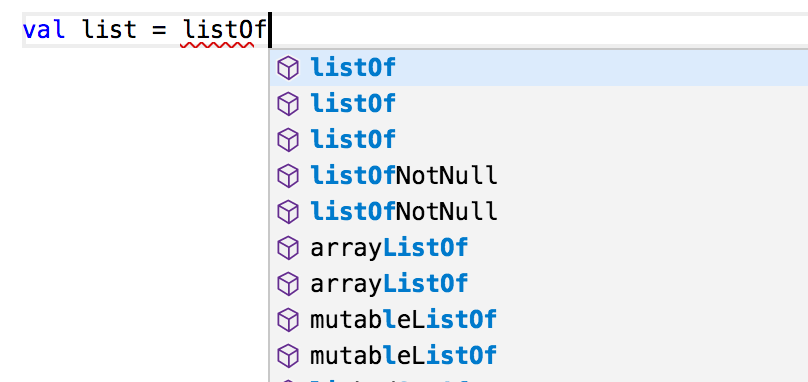
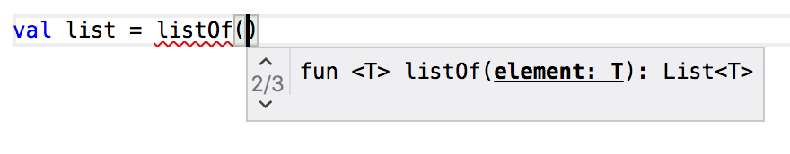
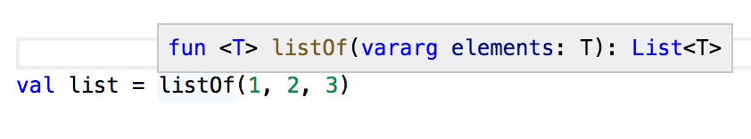
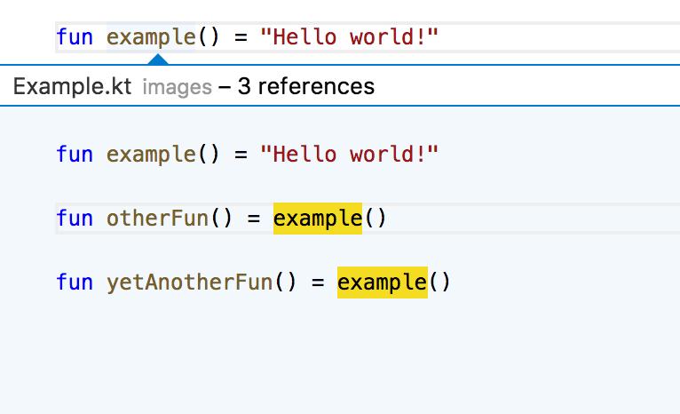
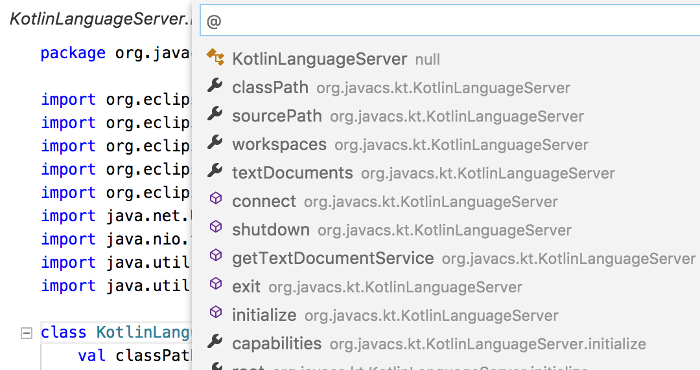
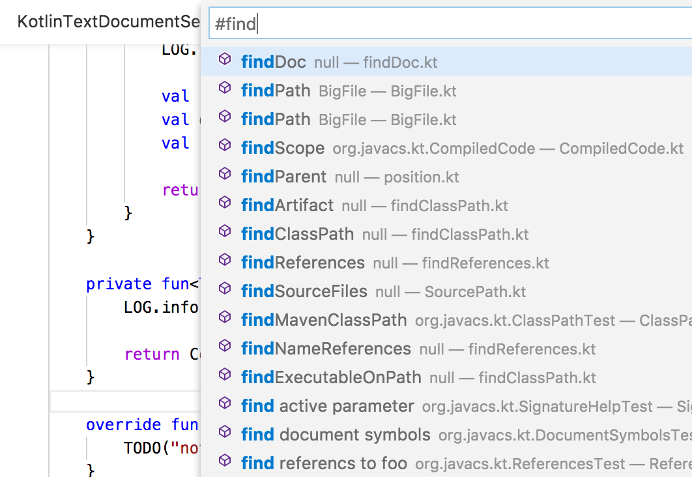

<h1> ktlsp (community fork)</h1>

<!--
TODO: investigate how to get download count for Codeberg releases

-->

A [language server][lsp-page] that provides smart code completion, diagnostics, hover, document symbols, definition lookup, method signature help and more for [Kotlin](https://kotlinlang.org).

This public fork of [winlogon/ktlsp](https://codeberg.org/winlogon/ktlsp) tracks
[Android readiness](docs/android-readiness.md) while remaining usable by any LSP editor.
Android runtime and project support are being verified, not yet declared complete.
The [evaluated Gradle importer](docs/gradle-project-import.md) now preserves compilation
and script inputs independently; wiring them into modern editor analysis remains in progress.
Open-document text and versions remain client-owned across saves and filesystem
notifications; disk content becomes authoritative again when the document closes.

> [!IMPORTANT]
> This project is a community-maintained fork of [`fwcd/kotlin-language-server`][upstream].
> It exists to continue maintenance, merge community contributions, and address issues that have not been resolved upstream.
>
> **Status note**: This fork is under active development, and commits may introduce breaking changes. The intended stable release is version 1.4.0.

### Relationship to other Kotlin LSP projects

There are multiple similarly named projects in the Kotlin ecosystem. This project is **not** the official Kotlin LSP implementation maintained by JetBrains/Kotlin Foundation.

- **Upstream**: [`fwcd/kotlin-language-server`][upstream] — original project this fork is based on
- **Official Kotlin LSP**: [`Kotlin/kotlin-lsp`](https://github.com/Kotlin/kotlin-lsp) — separate implementation maintained by JetBrains
- **Other forks**: including various community-maintained alternatives with similar goals but different architectures

> [!NOTE]
> The official Kotlin LSP uses proprietary JetBrains components, and not all of these are available in the public repository.
>
> As a result, the published builds cannot be fully reproduced from source alone.

Any editor conforming to LSP is supported, including [VSCode](https://github.com/fwcd/vscode-kotlin) and [Atom](https://github.com/fwcd/atom-ide-kotlin).

## Getting Started

* See [Getting Started](docs/getting-started.md) for a quick setup guide
* See [Editor Integration](docs/editors.md) for editor-specific instructions
* See [Building](docs/building.md) for build instructions
* See [Configuration](docs/configuration.md) for server configuration

### Documentation

* [Features](docs/features.md) — All available LSP features and their status
* [Architecture](docs/architecture/overview.md) — Project architecture
* [API Reference](docs/reference/lsp-extensions.md) — Protocol extensions
* [Classpath Resolution](docs/reference/classpath-resolution.md) — Dependency resolution
* [Communication Modes](docs/contributing/communication-modes.md) — Client connections
* [Troubleshooting](docs/troubleshooting.md) — Common issues and solutions
* [FAQ](docs/faq.md) — Frequently asked questions

### For Contributors

* [Contributing Guidelines](CONTRIBUTING.md) — How to contribute
* [Coding Guidelines](docs/contributing/coding-guidelines.md) — Code conventions and patterns
* [Modules](docs/architecture/modules.md) — Module structure

* See [Roadmap](https://github.com/fwcd/kotlin-language-server/projects/1) for features, planned additions, bugfixes and changes
* See [Kotlin Quick Start](https://github.com/fwcd/kotlin-quick-start) for a sample project
* See [Kotlin Debug Adapter](https://github.com/fwcd/kotlin-debug-adapter) for editor-agnostic launch and debug support of Kotlin/JVM programs
* See [tree-sitter-kotlin](https://github.com/fwcd/tree-sitter-kotlin) for an experimental [Tree-Sitter](https://tree-sitter.github.io/tree-sitter/) grammar

If you have information about how to reproduce a bug, please share it in the corresponding issue or open a new issue if one does not already exist.

### Requirements

`kotlin-language-server` requires:
- A JVM capable of running Java 21 or newer
- UTF-8 source files

## Contributing and getting help

This project is a community-maintained fork of the original [kotlin-language-server][upstream] and continues active development.

Contributions, bug reports, and reproducible test cases are welcome and help improve stability and editor compatibility. Before contributing, please read our [Contributing Guidelines](CONTRIBUTING.md).

### Areas that are still complex

Language server implementations have a few inherently difficult parts:

- Supporting incremental compilation and analysis as code changes
- Keeping performance stable across large projects
- Ensuring consistent state between editor sessions

This project relies on internal Kotlin compiler APIs provided by the [Kotlin compiler](https://github.com/JetBrains/kotlin/tree/master/compiler) from JetBrains.

### Dependency resolution

To provide smart language features, the server must resolve your project's dependencies. It automatically supports Gradle and Maven projects, but also allows for custom resolution via shell scripts.

For detailed information on how dependencies are resolved and how to configure custom setups, see the [Classpath Resolution guide](docs/reference/classpath-resolution.md).

### Incrementally re-compiling as the user types

I get incremental compilation at the file-level by keeping the same `KotlinCoreEnvironment` alive between compilations in [Compiler.kt](server/src/main/kotlin/org/javacs/kt/compiler/Compiler.kt). There is a performance benchmark in [OneFilePerformance.kt](server/src/test/kotlin/org/javacs/kt/OneFilePerformance.kt) that verifies this works.

Getting incremental compilation at the expression level is a bit more complicated:
- Fully compile a file and store in [CompiledFile](server/src/main/kotlin/org/javacs/kt/CompiledFile.kt):
    - `val content: String` A snapshot of the source code
    - `val parse: KtFile` The parsed AST
    - `val compile: BindingContext` Additional information about the AST from typechecking
- After the user edits the file:
    - Find the smallest section the encompasses all the user changes
    - Get the `LexicalScope` encompassing this region from the `BindingContext` that was generated by the full-compile
    - Create a fake, in-memory .kt file with just the expression we want to re-compile
        - [Add space](https://github.com/fwcd/kotlin-language-server/blob/427cfa7a688d6d2ff202625ebad1ea605e3b8c37/server/src/main/kotlin/org/javacs/kt/CompiledFile.kt#L125) at the top of the file so the line numbers match up
    - Re-compile this tiny fake file

The incremental expression compilation logic is all in [CompiledFile.kt](server/src/main/kotlin/org/javacs/kt/CompiledFile.kt). The Kotlin AST has a built-in repair API, which seems to be how IntelliJ works, but as far as I can tell this API does not work if the surrounding IntelliJ machinery is not present. Hence I created the "fake tiny file" incremental-compilation mechanism, which seems to be quite fast and predictable.

There is an extensive suite of behavioral [tests](server/src/test/kotlin/org/javacs/kt), which are all implemented in terms of the language server protocol, so you should be able to refactor the code any way you like and the tests should still work.

## Modules

| Name | Description |
| ---- | ----------- |
| server | The language server executable |
| shared | Classpath resolution and utilities |

## Scripts

| Name | Command | Description |
| ---- | ------- | ----------- |
| release_version.py | `python3 scripts/release_version.py` | Creates a tag for the current version and bumps the development version |

## Protocol Extensions

ktlsp supports some non-standard requests through LSP. See [KotlinProtocolExtensions](server/src/main/kotlin/org/javacs/kt/KotlinProtocolExtensions.kt) for a description of the interface. The general syntax for these methods is `kotlin/someCustomMethod`.

## Configuration

See [Configuration](docs/configuration.md) for compiler and editor settings.
Workspace caches use SQLite in `.kls/`; dependency license texts and source-access
notices are included in the server distribution.

## Features

See [Features](docs/features.md) for the complete list with configuration details.

### Autocomplete

### Signature help

### Hover

### Go-to-definition, find all references

### Document symbols

### Global symbols

## Maintainers

- 2018 [georgewfraser](https://github.com/georgewfraser) (original author)
- 2018-2025 [fwcd](https://github.com/fwcd)
- 2026-now [winlogon](https://codeberg.org/winlogon) / [github](https://github.com/walker84837)

[upstream]: https://github.com/fwcd/kotlin-language-server
[lsp-page]: https://microsoft.github.io/language-server-protocol/specification
