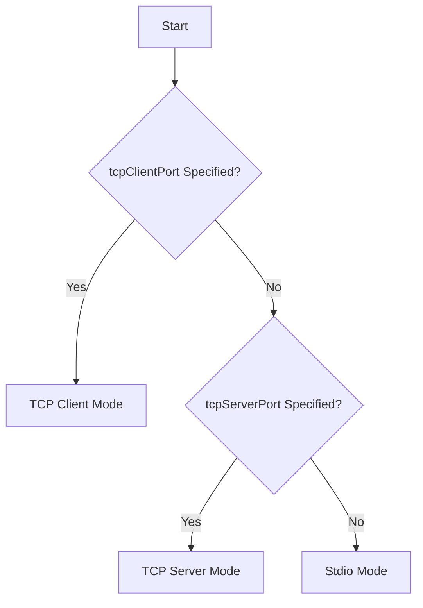

# Communication Modes

ktlsp supports three communication modes for connecting with LSP clients:

- **Stdio (default)**: Server reads from stdin (standard in) and writes to stdout (standard out),
- **TCP Server**: Server listens on a specific port for clients to connect,
- **TCP Client**: Server connects to a client running on a port and host.

## Modes

### Stdio (Default)

The server reads from standard input and writes to standard output. This is the default mode used by most editors.

**Usage:**

```bash
kotlin-language-server
```

**No arguments required.**

### TCP Server

The server listens on a specified port and waits for clients to connect. Useful for:

- Docker containers
- Remote development scenarios
- Debugging

**Usage:**

```bash
kotlin-language-server --tcpServerPort 5005
# or
kotlin-language-server -sp 5005
```

### TCP Client

The server connects to a client running on a specified host and port.

**Usage:**

```bash
kotlin-language-server --tcpClientHost localhost --tcpClientPort 5005
# or
kotlin-language-server -h localhost -p 5005
```

## Command-line arguments

| Argument          | Short | Description                          | Default     |
|-------------------|-------|--------------------------------------|-------------|
| `--tcpServerPort` | `-sp` | Port to listen on (TCP Server mode)  | -           |
| `--tcpClientPort` | `-p`  | Port to connect to (TCP Client mode) | -           |
| `--tcpClientHost` | `-h`  | Host to connect to (TCP Client mode) | `localhost` |
| `--version`       | `-V`  | Print version and exit               | -           |

To print the server version:

```bash
kotlin-language-server --version
# or
kotlin-language-server -V
```

## Mode selection logic

The server automatically determines the mode based on arguments provided:



## TCP configuration examples

### VSCode

VSCode typically uses stdio by default. For remote scenarios, configure the extension to use TCP.

### Docker

```dockerfile
FROM openjdk:21-slim
COPY server/build/install /app
EXPOSE 5005
CMD ["/app/bin/kotlin-language-server", "--tcpServerPort", "5005"]
```

### Neovim (TCP)

**Using vim.lsp (Neovim 0.11+):**

```lua
vim.lsp.config('kotlin_language_server', {
    cmd = {'kotlin-language-server', '--tcpServerPort', '5005'},
    filetypes = {'kotlin'},
    root_markers = {'build.gradle.kts', 'pom.xml'},
})

vim.lsp.enable('kotlin_language_server')
```

**Using nvim-lspconfig (legacy):**

```lua
require('lspconfig').kotlin_language_server.setup({
    cmd = {"kotlin-language-server", "--tcpServerPort", "5005"}
})
```

### Emacs (TCP)

```elisp
;; Connect to TCP server
(setq lsp-kotlin-server-install-dir "/path/to/server/")
(setq lsp-kotlin-ls-server '("kotlin-language-server" "--tcpClientPort" "5005"))
```

---

For editor-specific configurations, see [Editors](../editors.md).
